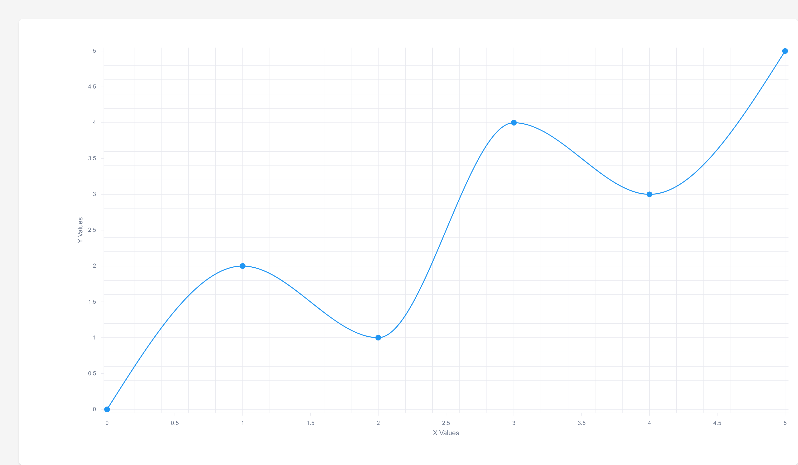

# Unovis SSR Bundle

[](https://www.npmjs.com/package/@tzmartin/unovis-ssr-bundle)
[](https://opensource.org/licenses/MIT)
[](https://github.com/tzmartin/unovis-ssr-bundle/actions/workflows/ci.yml)

A bundled version of [Unovis](https://unovis.dev/) optimized for server-side rendering (SSR) and static chart generation in headless environments. This package provides a pre-configured bundle of Unovis components and utilities for generating high-quality PNG visualizations via Puppeteer.



## Why This Bundle?

Server-side rendering of data visualizations presents unique challenges, particularly in headless environments:

1. **Static Chart Generation**: Headless servers cannot maintain dynamic chart state or handle interactive updates, requiring a pre-configured, static chart generation approach.

2. **Bundle Dependencies**: Standard Unovis imports may not work in SSR environments due to:
   - Module resolution differences between Node.js and browser environments
   - Dynamic imports that aren't compatible with static generation
   - Browser-specific APIs that aren't available in Node.js

3. **Performance Optimization**: This bundle:
   - Pre-configures chart components for static rendering
   - Handles D3.js dependencies efficiently
   - Provides a streamlined API for server-side chart generation

4. **Headless Browser Integration**: Includes setup for Puppeteer to render charts in a headless browser environment, managing the complexity of:
   - DOM manipulation in a server context
   - Font loading and rendering
   - SVG to PNG conversion
   - High-DPI output handling

## Features

- Bundled Unovis components for browser and SSR environments
- Binary chart generation utility
- TypeScript support
- Optimized bundle size with external D3.js dependencies

**Note:** This bundle currently supports a subset of Unovis APIs, primarily focused on line and bar charts as a starting point. Additional chart types and configurations may need to be added to the bundle configuration as needed.

## Included Components

The bundle includes the following Unovis components:
- XYContainer
- Line
- Axis
- SingleContainer
- StackedBar
- Donut
- Scatter
- Timeline

## Prerequisites

- Node.js (Latest LTS recommended)
- yarn or pnpm package manager
- Bun runtime (optional, only needed for binary generation)

## Installation

### Local Development
1. Clone the repository
2. Install dependencies:
```bash
# Preferred
bun install

# Alternative
pnpm install
```

### Using as a Dependency
Install the package from npm:

```bash
# Using npm
npm install @tzmartin/unovis-ssr-bundle

# Using yarn
yarn add @tzmartin/unovis-ssr-bundle

# Using pnpm
pnpm add @tzmartin/unovis-ssr-bundle
```

Note: Puppeteer is a peer dependency. If you plan to use the SSR features, you'll need to install it separately:
```bash
npm install puppeteer
```

## Building

The project includes several build scripts:

```bash
# Install dependencies
bun install # or pnpm install

# Build everything (including binary if Bun is installed)
bun run build

# Individual build steps
bun run prebuild         # Create dist directory
bun run build:unovis     # Bundle Unovis components
bun run build:binary     # Create binary chart generator (requires Bun)

# Development with watch mode
bun run watch

# Clean build artifacts
bun run clean
```

Note: The binary generation step (`build:binary`) is optional and requires Bun runtime. The main bundle can be built and used without Bun.

## Testing

The project includes a test suite to verify the bundle's functionality:

```bash
# Run tests (automatically builds the bundle first)
bun test

# Clean and test
bun run clean && bun test
```

Test files are located in the `test` directory:
- `bundle.test.js`: Verifies bundle generation and exports
- `data/sample.json`: Sample data for testing chart generation

## Project Structure

```bash
unovis-bundle/
├── src/
│   └── bundle-entry.ts    # Main entry point for Unovis components
├── test/
│   ├── data/
│   │   └── sample.json    # Sample data for testing
│   ├── bundle.test.js     # Bundle tests
│   └── main.js           # SSR chart generation test
├── dist/                 # Built files
├── rollup.config.mjs     # Rollup bundler configuration
├── tsconfig.json         # TypeScript configuration
└── package.json          # Project dependencies and scripts
```

## Usage

### 1. Browser Usage
```html
<!-- Using CDN -->
<script src="https://unpkg.com/@tzmartin/unovis-ssr-bundle"></script>

<!-- Or include locally -->
<script src="node_modules/@tzmartin/unovis-ssr-bundle/dist/unovis-bundle.js"></script>
```

### 2. ESM Import
```javascript
import { XYContainer, Line } from '@tzmartin/unovis-ssr-bundle';

// Create a simple line chart
const data = [
  { x: 0, y: 10 },
  { x: 1, y: 15 },
  { x: 2, y: 8 }
];

const line = new Line({
  x: d => d.x,
  y: d => d.y
});

const container = new XYContainer(document.getElementById('vis-container'), {
  components: [line]
}, data);
```

### 3. Server-Side Chart Generation
```bash
# Using the binary directly
./node_modules/.bin/chart-gen --input data.json --output chart.png --width 800 --height 600

# Or via npm scripts (add to your package.json):
{
  "scripts": {
    "generate-chart": "chart-gen --input data.json --output chart.png"
  }
}
```

## Development

To modify or extend the bundle:

1. Add/remove components in `src/bundle-entry.ts`
2. Update rollup configuration if needed
3. Run build scripts
4. Test the output in your target environment

**Important:** This bundle includes a limited subset of Unovis components, primarily focused on line and bar charts. To add support for additional chart types or configurations:
1. Update `src/bundle-entry.ts` to import and export the desired components
2. Modify `rollup.config.mjs` if additional external dependencies are needed
3. Test thoroughly with your specific use case

## Contributing

Pull requests are welcome. For major changes, please open an issue first to discuss what you would like to change.

## License

MIT License - see the LICENSE file for details

## Acknowledgments

Special thanks to the [Unovis contributors](https://github.com/f5/unovis/graphs/contributors) for their excellent visualization library.

